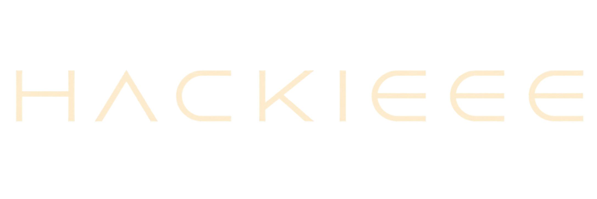

<p align="center">
  
</p>

<h1 align="center">HackIEEE</h1>

<p align="center">
  <strong>The Dune-themed hackathon by IEEE Computer Society, Nirma University</strong>
</p>

<p align="center">
  <a href="https://github.com/IEEE-Computer-Nirma/HackIEEE">
    
  </a>
  <a href="https://github.com/IEEE-Computer-Nirma/HackIEEE">
    
  </a>
  <a href="https://github.com/IEEE-Computer-Nirma/HackIEEE">
    
  </a>
  <a href="https://github.com/IEEE-Computer-Nirma/HackIEEE">
    
  </a>
</p>

---

## 🏜️ About

**HackIEEE** is the flagship hackathon jointly organised by three **IEEE Student Chapters at Nirma University**:

- **IEEE Computer Society (CS)**
- **IEEE Intelligent Transportation Systems Society (ITSS)**
- **IEEE Signal Processing Society (SPS)**

This repository contains the landing page — a fully immersive, Dune-inspired web experience built to capture the spirit of the event: innovation under pressure, collaboration across the sands, and the will to build something extraordinary.

The site features cinematic hero sections, GSAP-powered animations, a custom Morph Slider, ambient soundscapes, light/dark Dune-themed palettes, and a sponsorship pipeline backed by Supabase + Resend.

---

## ✨ Features

- 🎬 **Cinematic Hero** — Full-screen Dune-themed hero with particle effects and parallax
- 🎨 **Dual Theme** — Light (desert) and dark (night) Arrakis-inspired palettes
- 🔊 **Ambient Sound** — Toggle-able soundscapes using Howler.js
- 🎠 **Morph Slider** — Custom WebGL-powered track showcase with OGL
- ⏳ **Interactive Timeline** — GSAP-animated event timeline
- 📬 **Sponsorship Portal** — Form with Zod validation, Supabase storage, and Resend emails
- 📱 **Fully Responsive** — Mobile-first design with smooth page transitions
- 📊 **Analytics** — Vercel Analytics and Speed Insights baked in

---

## 🛠️ Tech Stack

| Layer         | Technology                                              |
| ------------- | ------------------------------------------------------- |
| Framework     | [Next.js 16](https://nextjs.org) (App Router, Turbopack)|
| Language      | TypeScript 5                                            |
| Styling       | Tailwind CSS 4                                          |
| Animations    | GSAP 3 + `@gsap/react`                                 |
| 3D / WebGL    | OGL                                                     |
| Audio         | Howler.js                                               |
| Backend       | Supabase (DB + Storage) · Resend (Emails)               |
| Validation    | Zod                                                     |
| Icons         | Lucide React                                            |
| Analytics     | Vercel Analytics · Vercel Speed Insights                |

---

## 🚀 Getting Started

### Prerequisites

- **Node.js** ≥ 18
- **npm**, **yarn**, **pnpm**, or **bun**

### Setup

```bash
# 1. Clone the repository
git clone https://github.com/IEEE-Computer-Nirma/HackIEEE.git
cd HackIEEE

# 2. Install dependencies
npm install

# 3. Create your env file
cp .env.local.example .env.local
# Fill in Supabase and Resend keys

# 4. Start the dev server
npm run dev
```

Open [http://localhost:3000](http://localhost:3000) to see the site.

---

## 📁 Project Structure

```
hackieee/
├── app/
│   ├── components/      # All UI components (Hero, Navbar, Tracks, etc.)
│   ├── data/            # Static data and content
│   ├── fonts/           # Custom typefaces
│   ├── sponsorship/     # /sponsorship route
│   ├── globals.css      # Design tokens and global styles
│   ├── layout.tsx       # Root layout with metadata and providers
│   └── page.tsx         # Home page composition
├── lib/                 # Shared utilities
├── services/            # Backend service layer
├── supabase/            # Supabase config and migrations
├── public/              # Static assets (images, audio, SVGs)
├── docs/                # Project documentation
└── next.config.ts       # Next.js configuration
```

---

## 📝 Commit Convention

We follow [Conventional Commits](https://www.conventionalcommits.org/). Every commit message should use this format:

```
<type>(optional scope): short description
```

| Type         | Purpose                        | Example                                      |
| ------------ | ------------------------------ | -------------------------------------------- |
| `feat:`      | New feature                    | `feat(hero): add spice-drift particle layer` |
| `fix:`       | Bug fix                        | `fix(navbar): close menu on route change`    |
| `docs:`      | Documentation                  | `docs(readme): add setup instructions`       |
| `style:`     | Code style / visual changes    | `style(tracks): swap palette to arrakis`     |
| `refactor:`  | Code restructuring             | `refactor(form): extract validation logic`   |
| `test:`      | Tests                          | `test(api): add sponsor endpoint tests`      |
| `chore:`     | Build, config, or dependency   | `chore(deps): bump next to 16.3.4`          |

> **Rules:** imperative mood · lowercase subject · no trailing period · keep it small and honest.

---

## 🤝 Contributing

We'd love your contributions! Please read our full **[CONTRIBUTING.md](CONTRIBUTING.md)** before getting started.

**The TL;DR:**

1. **Branch** off `main` — never commit directly to it.
2. **Name your branch** with a prefix: `feat/`, `fix/`, `style/`, `chore/`, `docs/`
3. **Commit** using the convention above.
4. **Push your branch** and open a **Pull Request**.
5. **Get a review** — at least one approval required.
6. **Squash and merge** — then delete the branch.

> ⚠️ **Force-pushing is banned.** No `--force`, no `-f`, no exceptions. Use `git revert` to undo mistakes.

---

## 🧑‍💻 Useful Commands

```bash
npm run dev       # Start dev server (Turbopack)
npm run build     # Production build
npm run start     # Serve production build
npm run lint      # Run ESLint
```

---

## 📄 License

This project is maintained by **IEEE CS**, **IEEE ITSS**, and **IEEE SPS** — student chapters at [Nirma University](https://github.com/IEEE-Computer-Nirma).

---

<p align="center">
  <em>"The mystery of life isn't a problem to solve, but a reality to experience."</em><br />
  — Frank Herbert, <strong>Dune</strong>
</p>
